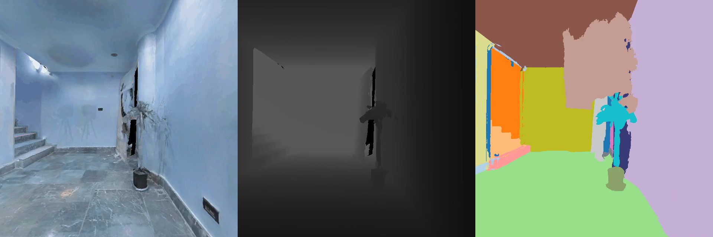
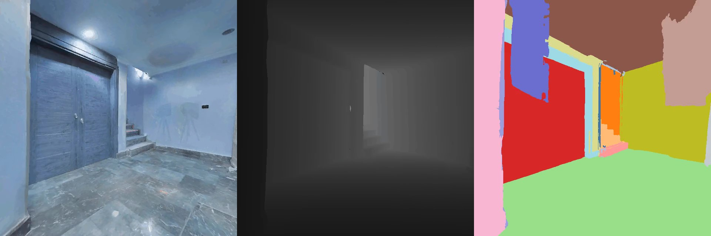
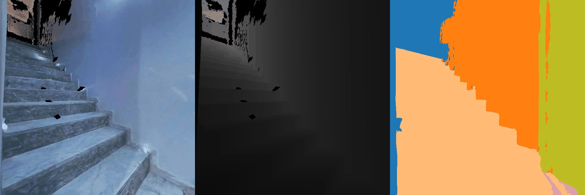

Imagine I am a robot equipped with a camera and a depth sensor. I am trying to perform a task, and you should help me by sending me commands. You are only allowed to give me the following commands:

- turn(angle): turn the robot by a given number of degrees
- move(distance): moves the robot straight forward by a given distance in meters.

On each step, I will provide you with the objects in the scene as a list of \<object name, distance, angle in degrees\>. You should reply with only one command at a time. The distance is in meters, and the direction an angle in degrees with respect to the robot's orientation. Negative angles are to the left and positive angles are to the right. If a command is not valid, I will ignore it and ask you for another command. If there is no relevant information in the scene, use the available commands to explore the environment. \

 


Task: navigate to the stairs \
Objects in the scene: \<door, 1.15 m, 12\>, \<door, 0.79 m, 15\>, \<door, 4.43 m, 0\>, \<plant, 3.36 m, 2\>, \<column, 3.40 m, 4\>, \<, 0.63 m, -13\>, \<door, 0.57 m, -24\>, \<door, 0.82 m, 4\>\
Command:

---

```
move(1.5) # Move straight ahead 1.5 meters to explore the environment. 
```

 

---
 
Objects in the scene: \<stairs, 2.99 m, -21\>, \<objects, 2.68 m, -19\>, \<door, 2.93 m, 1\>, \<plant, 1.80 m, 5\>, \<column, 1.95 m, 7\>, \<objects, 1.67 m, 5\>\
Command:

---

```
turn(-21) # Turn towards the stairs. 
```

---
 

Objects in the scene: \<stairs, 3.75 m, -3\>, \<door, 2.04 m, -18\>, \<objects, 3.30 m, -2\>, \<door, 2.47 m, 17\>, \<plant, 1.40 m, 22\>, \<door, 2.46 m, -11\>, \<column, 1.48 m, 25\>, \<objects, 1.29 m, 23\>\
Command:

---

```
turn(-3) # Turn towards the stairs. 
```
 

---
 

Objects in the scene: \<stairs, 3.75 m, 3\>, \<door, 2.18 m, -11\>, \<objects, 3.27 m, 5\>, \<door, 2.36 m, 26\>, \<door, 2.56 m, -4\>\
Command:

---

```
move(3.75) # Move towards the stairs. 
```

---

Objects in the scene: \<stairs, 1.02 m, -14\>\
Command:

---

```
move(1) # Move closer to the stairs. 
```

 

----
----


</br>
</br>
</br>
Full navigation:

 
