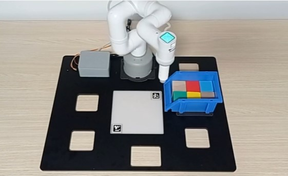
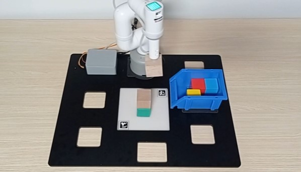
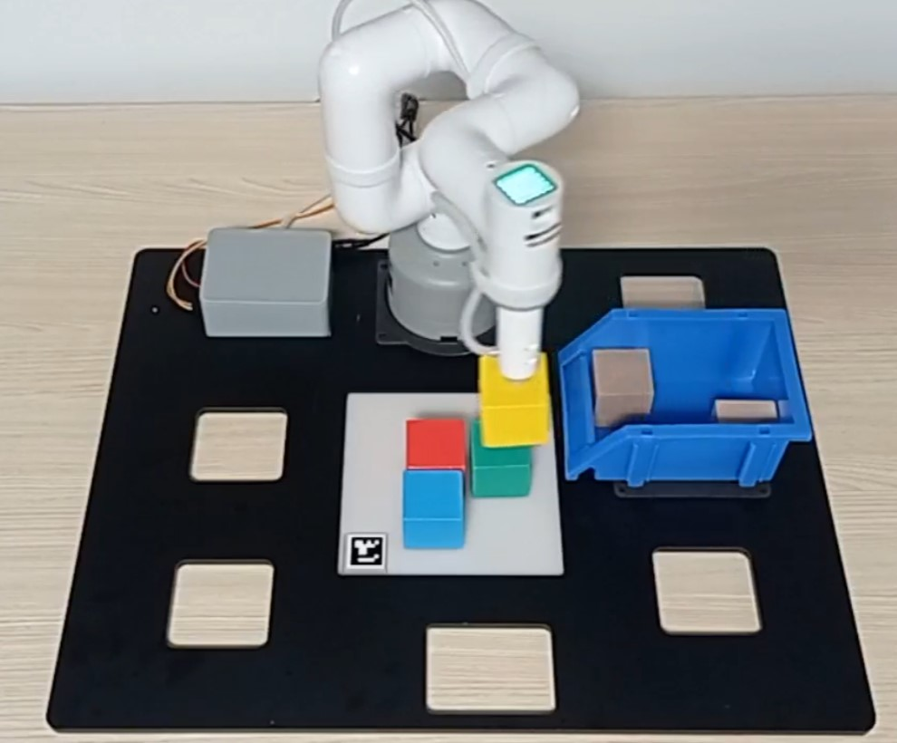

Imagine we are working with a manipulator robot. This is a robotic arm with 6 degrees of freedom that has a suction pump attached to its end effector. I would like you to assist me in sending commands to this robot given a scene and a task.



At any point, you have access to the following functions: 
- grab(): Turn on the suction pump to grab an object 
- release(): Turns off the suction pump to release an object 
- get_position(object): Given a string of an object name, returns the coordinates and orientation of the vacuum pump to touch the top of the object [X, Y, Z, Yaw, Pitch, Roll] 
- move_to(position): It moves the suction pump to a given position [X, Y, Z, Yaw, Pitch, Roll]. 

You are allowed to create new functions using these, but you are not allowed to use any other hypothetical functions.

Keep the solutions simple and clear. The positions are given in mm and the angles in degrees. You can also ask clarification questions using the tag "Question - ". Here is an example scenario that illustrates how you can ask clarification questions. 

Let's assume a scene contains two spheres. 

Me: pick up the sphere. You: Question - there are two spheres. Which one do you want me to pick up? Me: Sphere 1, please. 

Use python code to express your solution. 

Are you ready?

---------------------------------------------------------------------------

Yes, I'm ready. Please describe the scene and the task.

---------------------------------------------------------------------------

In the scene there are the following objects: white pad, box, blue block, yellow block, green block, red block, brown block 1, brown block 2. The blocks are cubes with height of 40 mm and are located inside the box that is 80 mm deep. The blocks can only be reached from the top of the box. I want you to learn the skill of picking up a single object and holding it. For that you need to move a safe distance above the object (100 mm), reach the object, grab it and bring it up.

---------------------------------------------------------------------------

Understood. Here's a Python function that takes the name of an object, moves the robot arm above the object, grabs it, and moves the object up to a safe distance of 100 mm above the object. Note that the function assumes that the robot arm is initially at a safe starting position.

```python
import time

def pick_up_object(object_name):
    # get the position of the object
    object_pos = get_position(object_name)
    
    # move the robot arm to a safe position above the object
    safe_pos = [object_pos[0], object_pos[1], object_pos[2]+100, object_pos[3], object_pos[4], object_pos[5]]
    move_to(safe_pos)
    
    # move the robot arm to the object's position
    move_to(object_pos)
    
    # grab the object
    grab()
    time.sleep(1) # wait for the object to be firmly attached
    
    # move the robot arm back to the safe position above the object
    move_to(safe_pos)
```

To use this function, simply call pick_up_object and provide the name of the object you want to pick up as a string, e.g. pick_up_object("red block").

---------------------------------------------------------------------------

Great! Now I want you to learn how to place and object in a position. Considering you are holding a generic object, you first need to first move to a safe position above the target location, bring the object down and then release it.

---------------------------------------------------------------------------

Understood. Here's a Python function that takes the position where the object should be placed, moves the robot arm above the position, brings the object down, and releases it. Note that the function assumes that the robot arm is holding an object.

```python
def place_object(position):
    # move the robot arm to a safe position above the target location
    safe_pos = [position[0], position[1], position[2]+100, position[3], position[4], position[5]]
    move_to(safe_pos)
    
    # move the robot arm to the target location
    move_to(position)
    
    # release the object
    release()
    
    # move the robot arm back to the safe position above the target location
    move_to(safe_pos)
```
To use this function, simply call place_object and provide the target position as a list of 6 numbers, e.g. place_object([100, 200, 50, 0, 0, 0]). Note that the units of the position are in mm and the orientation angles are in degrees.

---------------------------------------------------------------------------

Great! Now I want you to use these skills to pick up green block and and place on the white pad. All blocks have a height of 40 mm.

---------------------------------------------------------------------------

Sure! Here's the Python code to pick up the green block and place it on the white pad:

```python
# get the positions of the green block and white pad
green_pos = get_position("green block")
white_pos = get_position("white pad")

# pick up the green block
pick_up_object("green block")

# calculate the position to place the block on the white pad
place_pos = [white_pos[0], white_pos[1], white_pos[2]+40, 0, 0, 0]

# place the block on the white pad
place_object(place_pos)
```

This code gets the positions of the green block and white pad using the get_position function, picks up the green block using the pick_up_object function we defined earlier, calculates the position to place the block on the white pad, and places the block on the white pad using the place_object function we defined earlier. Note that we add the height of the block (40 mm) to the height of the white pad to ensure that the block is placed on top of the pad.

---------------------------------------------------------------------------

Great! Now I want you to stack both brown blocks on top of the green block.

---------------------------------------------------------------------------

Sure! Here's the Python code to stack the two brown blocks on top of the green block:

```python
# get the positions of the green block and both brown blocks
green_pos = get_position("green block")
brown1_pos = get_position("brown block 1")
brown2_pos = get_position("brown block 2")

# pick up the first brown block
pick_up_object("brown block 1")

# calculate the position to place the block on top of the green block
place_pos = [green_pos[0], green_pos[1], green_pos[2]+40, 0, 0, 0]

# place the first brown block on top of the green block
place_object(place_pos)

# pick up the second brown block
pick_up_object("brown block 2")

# calculate the position to place the block on top of the first brown block
place_pos = [green_pos[0], green_pos[1], green_pos[2]+80, 0, 0, 0]

# place the second brown block on top of the first brown block
place_object(place_pos)
```



This code gets the positions of the green block and both brown blocks using the get_position function, picks up the first brown block using the pick_up_object function we defined earlier, calculates the position to place the first brown block on top of the green block, and places the first brown block on top of the green block using the place_object function we defined earlier. Then, it picks up the second brown block, calculates the position to place the second brown block on top of the first brown block, and places the second brown block on top of the first brown block using the place_object function we defined earlier. Note that we add the height of the green block (40 mm) to the height of the previous block to ensure that the block is placed on top of the previous block.

---------------------------------------------------------------------------

Awesome! I want now to use the blocks to build the logo from Microsoft on top of the white pad. It consists of four colors forming a square, blue on the bottom left, yellow on the bottom right, red on the top left and green on the top right.

---------------------------------------------------------------------------

Sure! Here's the Python code to build the Microsoft logo on top of the white pad using the blocks:


```python
# get the positions of the blocks and the white pad
white_pad_pos = get_position("white pad")
blue_pos = get_position("blue block")
yellow_pos = get_position("yellow block")
red_pos = get_position("red block")
green_pos = get_position("green block")

# pick up the blue block
pick_up_object("blue block")

# calculate the position to place the blue block
place_pos = [white_pad_pos[0]-20, white_pad_pos[1]-20, white_pad_pos[2]+40, 0, 0, 0]

# place the blue block on the white pad
place_object(place_pos)

# pick up the yellow block
pick_up_object("yellow block")

# calculate the position to place the yellow block
place_pos = [white_pad_pos[0]+20, white_pad_pos[1]-20, white_pad_pos[2]+40, 0, 0, 0]

# place the yellow block on the white pad
place_object(place_pos)

# pick up the red block
pick_up_object("red block")

# calculate the position to place the red block
place_pos = [white_pad_pos[0]-20, white_pad_pos[1]+20, white_pad_pos[2]+40, 0, 0, 0]

# place the red block on the white pad
place_object(place_pos)

# pick up the green block
pick_up_object("green block")

# calculate the position to place the green block
place_pos = [white_pad_pos[0]+20, white_pad_pos[1]+20, white_pad_pos[2]+40, 0, 0, 0]

# place the green block on the white pad
place_object(place_pos)
```



This code gets the positions of the white pad and all four blocks using the get_position function, picks up each block in turn using the pick_up_object function we defined earlier, calculates the position to place the block on the white pad, and places the block on the white pad using the place_object function we defined earlier. We use the block colors to ensure that the logo is built correctly. We place the blue block in the bottom left position, the yellow block in the bottom right position, the red block in the top left position, and the green block in the top right position, as specified in the prompt.


