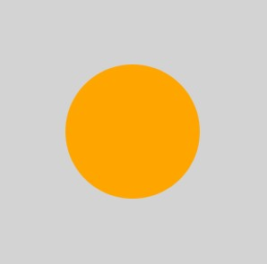
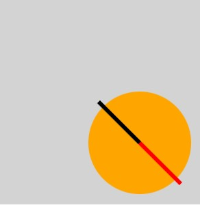
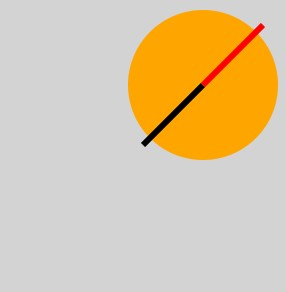

Imagine you are a planar robot that can move along the XY axes, and you’re positioned in the center of a basketball court. A person on the side of the court is going to throw a basketball ball in the air somewhere in the court, and your objective is to be at the exact XY location of the ball when it lands.

The robot has a monocular RGB camera that looks up. You can assume that the following functions are available:
- get_image(): returns an image from the robot’s camera looking up
- get_location(): returns 2 floats XY with the robot’s current location in the court
- move_to_point(x,y, vx, vy): moves the robot towards a specific (x,y) location in the court with velocity (vx,vy). You can assume for this exercise that the robot can accelerate or break instantly to any velocity.
- move_by_velocity(vx, vy): moves the robot along the X axis with velocity vx, and Y axis with velocity vy

Additional points to consider when giving your answer:
-	Your reponses should be informative, visual, logical and actionable.
-	Your logics and reasoning should be rigorous, intelligent, and defensible.
-	You can provide additional relevant details to respond thoroughly and comprehensively to cover multiple aspects in depth

Write a python script that executes a visual servoing approach towards catching the ball. You can use opencv functions to detect the ball as an orange blob.

---------------------------------------------------------------------------

Here's a sample implementation of the script:

```python
import cv2
import numpy as np

def detect_ball(frame):
    # Convert the image to HSV color space for better color detection
    hsv = cv2.cvtColor(frame, cv2.COLOR_BGR2HSV)

    # Define the range of orange color in HSV
    lower_orange = np.array([10,100,100])
    upper_orange = np.array([30,255,255])

    # Threshold the image to get only the orange color
    mask = cv2.inRange(hsv, lower_orange, upper_orange)

    # Find the contours of the thresholded image
    contours, _ = cv2.findContours(mask, cv2.RETR_EXTERNAL, cv2.CHAIN_APPROX_SIMPLE)

    # If a contour is found, return its center
    if len(contours) > 0:
        c = max(contours, key=cv2.contourArea)
        M = cv2.moments(c)
        if M["m00"] > 0:
            center = (int(M["m10"] / M["m00"]), int(M["m01"] / M["m00"]))
            return center
    return None

def catch_ball():
    # Continuously get images from the camera
    while True:
        frame = get_image()

        # Detect the ball in the image
        ball_center = detect_ball(frame)

        # If the ball is detected, move towards its location
        if ball_center is not None:
            x, y = ball_center
            robot_x, robot_y = get_location()
            vx = (x - robot_x) * 0.5
            vy = (y - robot_y) * 0.5
            move_by_velocity(vx, vy)

if __name__ == '__main__':
    catch_ball()

```

This script uses the detect_ball function to detect the ball in the image captured by the robot's camera. The function converts the image to the HSV color space and threshold the image to get only the pixels in the range of orange color, which is defined by lower_orange and upper_orange. Then it finds the contours of the thresholded image and returns the center of the largest contour if found.

The catch_ball function continuously gets images from the camera and calls the detect_ball function to detect the ball in the image. If the ball is detected, it calculates the velocity vx and vy to move towards the ball's location by dividing the difference between the ball's and robot's locations by 2. Then it calls the move_by_velocity function to move the robot towards the ball.

This implementation uses a simple visual servoing approach where the robot moves towards the ball at a constant velocity. The velocity is proportional to the difference between the ball's and robot's locations, so the robot will move faster as it gets closer to the ball. You can adjust the gain (i.e., the multiplication factor of 0.5) to control the speed of the robot.

---------------------------------------------------------------------------

Generate SVG code that depicts how the ball would look in the camera image exactly in the center

---------------------------------------------------------------------------

Here's an example of an SVG code that depicts a ball in the center of a camera image:

```svg
<svg width="100" height="100">
  <rect x="0" y="0" width="100" height="100" fill="lightgray"/>
  <circle cx="50" cy="50" r="25" fill="orange"/>
</svg>
```



This SVG code creates a rectangle that represents the camera image with a size of 100x100 pixels and fills it with a light gray color. Then it creates a circle with a radius of 25 pixels and fills it with orange color, which represents the ball. The center of the circle is placed at (50, 50), which is the center of the camera image.

You can adjust the size of the camera image and the ball by changing the width and height attributes of the \<svg\> element and the r attribute of the \<circle\> element.

---------------------------------------------------------------------------

Now generate SVG code corresponding to the moment when the robot is moving with the maximum positive vx and vy

---------------------------------------------------------------------------

Here's an example of an SVG code that depicts a ball in a camera image while the robot is moving with the maximum positive vx and vy:

```svg
<svg width="100" height="100">
  <rect x="0" y="0" width="100" height="100" fill="lightgray"/>
  <circle cx="70" cy="70" r="25" fill="orange"/>
  <polyline points="50,50 70,70" stroke="black" stroke-width="2"/>
  <polyline points="70,70 90,90" stroke="red" stroke-width="2"/>
</svg>
```



This SVG code creates a rectangle that represents the camera image with a size of 100x100 pixels and fills it with a light gray color. Then it creates a circle with a radius of 25 pixels and fills it with orange color, which represents the ball. The center of the circle is placed at (70, 70), which represents the ball's location in the camera image after the robot has moved with the maximum positive vx and vy.

To show the movement of the robot, we can add two \<polyline\> elements. The first \<polyline\> element represents the movement of the robot before it reaches the maximum vx and vy and has a black color. The second \<polyline\> element represents the movement of the robot after it reaches the maximum vx and vy and has a red color. The points attribute of the \<polyline\> elements define the start and end points of the line segments.

You can adjust the position of the ball and the movement of the robot by changing the cx and cy attributes of the \<circle\> element and the points attribute of the \<polyline\> elements.


---------------------------------------------------------------------------

Now generate SVG code corresponding to the moment when the robot is moving with positive vx and negative vy

---------------------------------------------------------------------------

Here's an example of an SVG code that depicts a ball in a camera image while the robot is moving with positive vx and negative vy:

```svg
<svg width="100" height="100">
  <rect x="0" y="0" width="100" height="100" fill="lightgray"/>
  <circle cx="70" cy="30" r="25" fill="orange"/>
  <polyline points="50,50 70,30" stroke="black" stroke-width="2"/>
  <polyline points="70,30 90,10" stroke="red" stroke-width="2"/>
</svg>
```



This SVG code creates a rectangle that represents the camera image with a size of 100x100 pixels and fills it with a light gray color. Then it creates a circle with a radius of 25 pixels and fills it with orange color, which represents the ball. The center of the circle is placed at (70, 30), which represents the ball's location in the camera image after the robot has moved with positive vx and negative vy.

To show the movement of the robot, we can add two \<polyline\> elements. The first \<polyline\> element represents the movement of the robot before it reaches the positive vx and negative vy and has a black color. The second \<polyline\> element represents the movement of the robot after it reaches the positive vx and negative vy and has a red color. The points attribute of the \<polyline\> elements define the start and end points of the line segments.

You can adjust the position of the ball and the movement of the robot by changing the cx and cy attributes of the \<circle\> element and the points attribute of the \<polyline\> elements.

---------------------------------------------------------------------------